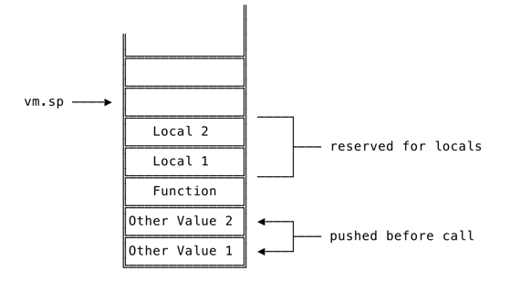
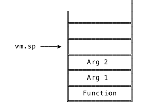

## Show Features

```python
Welcome to be friends with HuSharp's Rabbit!
>> let x = 1 * 2 * 3 * 4 * 5
120
>> x * y / 2 + 3 * 8 - 123
Woops! Compilation failed:
 undefined variable y
>> true == false
false
>>  let x 12 * 3;
                 
       /\_/\
       || ||  	
      ( o.o )
        >^<
       /   \
Woops! We jumped down the rabbit hole!
 parser errors:
	expected next token to be =, got INT instead
```

For Function
```python
>> let addTwo = fn(x) { x + 2; };
Closure[...] 
>> addTwo(2)
4
>> let multiply = fn(x, y) { x * y };
Closure[...]
>> multiply(50 / 2, 1 * 2)
50
>> fn(x) { x == 10 }(5)
false
>> fn(x) { x == 10 }(10)
true
```

for If expression. such as`if (true) { 10 } else { 20 }; 3333;` We will get opCode like that:


for local binding function
```python
>> let oneAndTwo = fn() { let one = 1; let two = 2; one + two; };
CompiledFunction[0x1400013a100]
>> oneAndTwo();
3
```



for function with arguments.
And arguments to function calls are a special case of local bindings.
```python
>> let newAdder = fn(x) { x }
CompiledFunction[0x140001064b0]
>> newAdder(1)
1
>> newAdder(2)
2
```



for built-in function
```python
>> let array = [1, 2, 3];
[1, 2, 3]
>> len(array);
3
>> push(array, 1)
[1, 2, 3, 1]
>> first(array)
1
>> rest(array)
[2, 3]
>> last(array)
3
>> first(rest(push(array, 4)))
2
```

for recursion closure to impl map
```python
let map = fn(arr, f) {
    let iter = fn(arr, accumulated) {
        if (len(arr) == 0) { 
            accumulated
        } else {
            iter(rest(arr), push(accumulated, f(first(arr))));
        } 
    };
    
    iter(arr, []);
    };
```

for recursion closure to calculate fibonacci
```python
		let fibonacci = fn(x) {
			if (x == 0) {
				return 0;
			} else {
				if (x == 1) {
					return 1;
				} else {
					fibonacci(x - 1) + fibonacci(x - 2);
				}
			}
		};
		fibonacci(15);
```

## Test Performance
```python
$ ./fibonacci -engine=eval                                                                                                 [8:37:35]
engine=eval, result=9227465, duration=11.327551667s

$ ./fibonacci -engine=vm                                                                                                   [8:38:23]
engine=vm, result=9227465, duration=3.907876125s


2.90 times faster
```
