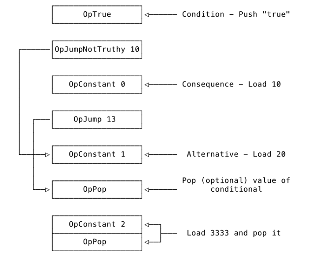

Show Code

```python
Welcome to Monkey Language!
>> let x = 1 * 2 * 3 * 4 * 5
let x = ((((1 * 2) * 3) * 4) * 5);
>> x * y / 2 + 3 * 8 - 123
((((x * y) / 2) + (3 * 8)) - 123)
>> true == false
(true == false)
>> let x 12 * 3;
            __,__
   .--.  .-"     "-.  .--.
  / .. \/  .-. .-.  \/ .. \
 | |  '|  /   Y   \  |'  | |
 | \   \  \ 0 | 0 /  /   / |
  \ '- ,\.-"""""""-./, -' /
   ''-' /_   ^ ^   _\ '-''
       |  \._   _./  |
       \   \ '~' /   /
        '._ '-=-' _.'
           '-----'
Woops! We ran into some monkey business here!
 parser errors:
	expected next token to be =, got INT instead
>> 
```

For Function
```python
 >> let addTwo = fn(x) { x + 2; };
>> addTwo(2)
4
>> let multiply = fn(x, y) { x * y };
>> multiply(50 / 2, 1 * 2)
50
>> fn(x) { x == 10 }(5)
false
>> fn(x) { x == 10 }(10)
true
```

For Closure
```python
>> let add = fn(a, b) { a + b };
>> let sub = fn(a, b) { a - b };
>> let applyFunc = fn(a, b, func) { func(a, b) };
>> applyFunc(2, 2, add);
4
>> applyFunc(10, 2, sub);
8
```

for `if (true) { 10 } else { 20 }; 3333;` We will get opCode like that:

