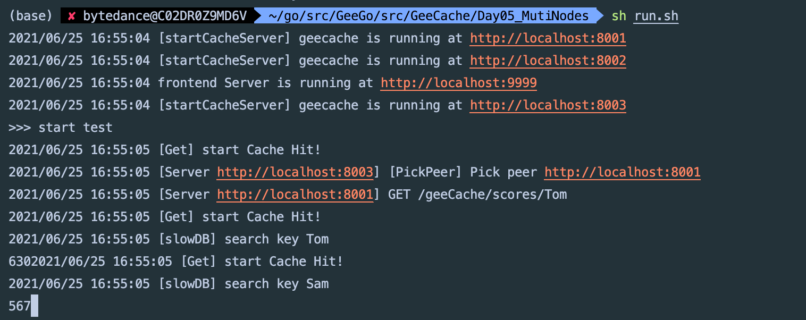
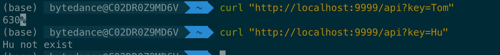
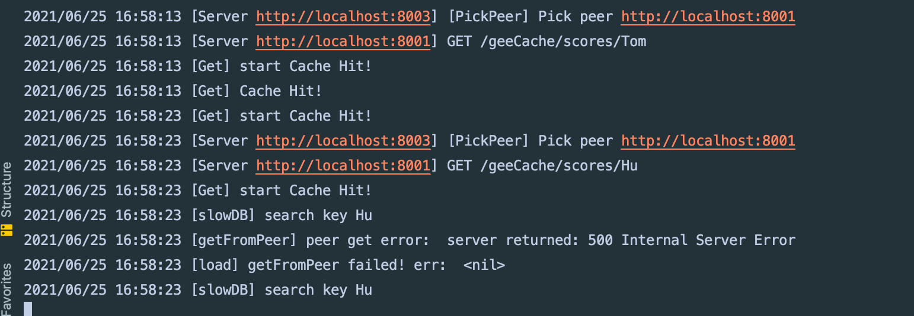

# 分布式缓存系统设计 Go 实现

实验环境为 GoLand， 采用 curl 调用观察。

设计一个分布式缓存系统，需要考虑资源控制、淘汰策略、并发、分布式节点通信等各个方面的问题。而且，针对不同的应用场景，还需要在不同的特性之间权衡，例如，是否需要支持缓存更新？还是假定缓存在淘汰之前是不允许改变的。不同的权衡对应着不同的实现。

[groupcache](https://github.com/golang/groupcache) 是 Go 语言版的 memcached，目的是在某些特定场合替代 memcached。groupcache 的作者也是 memcached 的作者。无论是了解单机缓存还是分布式缓存，深入学习这个库的实现都是非常有意义的。


## 支持特性

- 单机缓存和基于 HTTP 的分布式缓存
- 最近最少访问(Least Recently Used, LRU) 缓存策略
- 使用 Go 锁机制防止缓存击穿
- 使用一致性哈希选择节点，实现负载均衡
- 使用 protobuf 优化节点间二进制通信


# 具体介绍

## LRU 缓存淘汰策略的实现

#### Cache

创建一个包含字典和双向链表的结构体类型 Cache，方便实现后续的增删查改操作。

```go
type Cache struct {
	maxBytes	int64		// 允许使用最大内存
	usedBytes		int64		// 已经使用的内存
	ll			*list.List	// 双向链表
	cache		map[string]*list.Element	// 队首为 最新的
	OnEvicted	func(key string, value Value)	//	如果回调函数 OnEvicted 不为 nil，则调用回调函数。
}
```

- 键值对 `entry` 是双向链表节点的数据类型，在链表中仍保存每个值对应的 key 的好处在于，淘汰队首节点时，需要用 key 从字典中删除对应的映射。
- 为了通用性，我们允许值是实现了 `Value` 接口的任意类型，该接口只包含了一个方法 `Len() int`，用于返回值所占用的内存大小。

```go
type entry struct {
	key		string
	value 	Value
}

// Value use Len to count how many bytes it takes
type Value interface {
	Len()	int
}
```


### 功能介绍

#### 实例化

```go
// New 实例化
func New(maxBytes int64, OnEvicted func(key string, value Value)) *Cache {
	return &Cache{
		maxBytes: maxBytes,
		ll:       list.New(),
		cache:    make(map[string]*list.Element),
		OnEvicted: OnEvicted,
	}
}
```

#### 查找功能

查找主要有 2 个步骤，第一步是从字典中找到对应的双向链表的节点，第二步，将该节点移动到队首。

```go
// Get ：find
func (c *Cache) Get(key string) (val Value, ok bool) {
	// 如果存在，就取出，并移到队首
	if ele, ok := c.cache[key]; ok {
		c.ll.MoveToFront(ele)
		kv := ele.Value.(*entry)
		return kv.value, true
	}
	return
}
```

#### 删除功能

这里的删除，实际上是缓存淘汰。即移除最近最少访问的节点（队尾点）

```go
// RemoveOldest ：删除, 即移除队尾频率最少元素
func (c *Cache) RemoveOldest() {
	ele := c.ll.Back()
	if ele != nil {
		c.ll.Remove(ele)	// ll 中移除
		kv := ele.Value.(*entry)
		delete(c.cache, kv.key)	// map 中删除
		c.usedBytes -= int64(len(kv.key)) + int64(kv.value.Len())	// 使用内存去除
		if c.OnEvicted != nil {
			c.OnEvicted(kv.key, kv.value)	// 如果回调函数 OnEvicted 不为 nil，则调用回调函数。
		}
	}
}
```

#### 新增/修改功能

- 如果键存在，则更新对应节点的值，并将该节点移到队尾。
- 不存在则是新增场景，首先队尾添加新节点 `&entry{key, value}`, 并字典中添加 key 和节点的映射关系。
- 更新 `c.nbytes`，如果超过了设定的最大值 `c.maxBytes`，则移除最少访问的节点。

```go
// Add : add or modify
func (c *Cache) Add(key string, value Value) {
	// 判断是否存在
	if element, ok := c.cache[key]; ok {
		c.ll.MoveToFront(element)
		kv := element.Value.(*entry)
		// 由于 val 值可能更新，因此需要更新使用内存
		c.usedBytes += int64(value.Len()) - int64(kv.value.Len())
		kv.value = value
	} else {
		element := c.ll.PushFront(&entry{
			key:   key,
			value: value,
		})
		c.cache[key] = element
		c.usedBytes += int64(value.Len()) + int64(len(key))
	}
	// 由于更新可能会超过最大内存，因此需要删除，且可能删除一个还不够，所以采用 for
	for c.maxBytes != 0 && c.usedBytes > c.maxBytes {
		c.RemoveOldest()
	}
}
```

#### Len 函数

为了方便测试，我们实现 Len() 用来获取添加了多少条数据

```go
func (c *Cache) Len() int {
	return c.ll.Len()
}
```


## 单机并发缓存

### 支持并发读写

#### ByteView 表示缓存值

抽象了一个只读数据结构 `ByteView` 用来表示缓存值。

- ByteView 只有一个数据成员，`b []byte`，b 将会存储真实的缓存值。选择 byte 类型是为了能够支持任意的数据类型的存储，例如字符串、图片等。
- 实现 `Len() int` 方法，我们在 lru.Cache 的实现中，要求被缓存对象必须实现 Value 接口，即 `Len() int` 方法，返回其所占的内存大小。
- `b` 是只读的，使用 `ByteSlice()` 方法返回一个拷贝，防止缓存值被外部程序修改。

```go
// ByteView 抽象一个 只读数据结构， 用来表示缓存值
type ByteView struct {
	b []byte	// b 用来存储真实值
}

// Len 用来返回其所占的内存大小
func (v ByteView) Len() int {
	return len(v.b)
}

// ByteSlice 用来返回一个拷贝， 防止缓存值被外部修改
func (v ByteView) ByteSlice() []byte {
	return cloneBytes(v.b)
}

// String returns the data as a string, making a copy if necessary.
func (v ByteView) String() string {
	return string(v.b)
}

func cloneBytes(b []byte) []byte {
	newB := make([]byte, len(b))
	copy(newB, b)
	return newB
}
```

#### Mutex 实现并发

使用 `sync.Mutex` 封装 LRU 的几个方法，使之支持并发的读写。

- `cache.go` 的实现非常简单，实例化 lru，封装 get 和 add 方法，并添加互斥锁 mu。
- 在 `add` 方法中，判断了 `c.lru` 是否为 nil，如果等于 nil 再创建实例。这种方法称之为延迟初始化(Lazy Initialization)，一个对象的延迟初始化意味着该对象的创建将会延迟至第一次使用该对象时。主要用于提高性能，并减少程序内存要求。

```go
// cache 用来实例化 lru
type cache struct {
	mu 			sync.Mutex
	lru			*lru.Cache
	cacheBytes int64
}

func (c *cache) add(key string, val ByteView) {
	c.mu.Lock()
	defer c.mu.Unlock()
	if c.lru == nil {
		c.lru = lru.New(c.cacheBytes, nil)
	}
	c.lru.Add(key, val)
}

func (c *cache) get(key string) (val ByteView, ok bool) {
	c.mu.Lock()
	defer c.mu.Unlock()
	if c.lru == nil {
		return
	}
	if v, ok := c.lru.Get(key); ok {
		return v.(ByteView), ok
	}
	return
}
```


### Group 结构实现

Group 是 此实验中 最核心的数据结构，负责与用户的交互，并且控制缓存值存储和获取的流程。

```
                            是
接收 key --> 检查是否被缓存 -----> 返回缓存值 ⑴
                |  否                         是
                |-----> 是否应当从远程节点获取 -----> 与远程节点交互 --> 返回缓存值 ⑵
                            |  否
                            |-----> 调用`回调函数`，获取值并添加到缓存 --> 返回缓存值 ⑶
```

#### 回调 Getter 的实现

如果缓存不存在，应从数据源（文件，数据库等）获取数据并添加到缓存中。GeeCache 是否应该支持多种数据源的配置呢？不应该，一是数据源的种类太多，没办法一一实现；二是扩展性不好。如何从源头获取数据，应该是用户决定的事情，我们就把这件事交给用户好了。因此，我们设计了一个回调函数(callback)，在缓存不存在时，调用这个函数，得到源数据。

```go
type Getter interface {
	Get(key string) ([]byte, error)	// 回调函数
}

/*GetterFunc 是 一个接口型函数
	接口型函数只能应用于接口内部只定义了一个方法的情况
	这种类型实现了 Get 方法（在 Get 方法中又调用了自身）
	也就是说这个类型的函数其实就是一个 Getter 类型的对象。
	利用这种类型转换，我们可以将此类型的函数转换为一个 Getter 对象，
	而不需要定义一个结构体，再让这个结构实现 Get 方法。
*/
type GetterFunc func(key string) ([]byte, error)

func (f GetterFunc) Get(key string) ([]byte, error) {
	return f(key)
}
```


### Group 的实现

一个 Group 可以认为是一个缓存的命名空间，每个 Group 拥有一个唯一的名称 `name`。

```go
// Group 一个 Group 可以认为是一个缓存的命名空间
type Group struct {
	name	string
	getter	Getter		// 缓存未命中时获取源数据的回调(callback)。
	mainCache	cache
}

var (
	mu	sync.RWMutex
	groups	= make(map[string]*Group)
)

// NewGroup create a new instance
func NewGroup(name string, cacheBytes int64, getter Getter) *Group {
	if getter == nil {
		panic("nil Getter")
	}
	mu.Lock()
	defer mu.Unlock()
	g := &Group{
		name:      name,
		getter:    getter,
		mainCache: cache{cacheBytes: cacheBytes},
	}
	groups[name] = g
	return g
}

// GetGroup returns the named group previously created with NewGroup, or
// nil if there's no such group.
func GetGroup(name string) *Group {
	mu.RLock()	// 只读锁 因为不涉及任何冲突变量的写操作
	g := groups[name]
	mu.RUnlock()
	return g
}


```


### 功能介绍

#### Get 方法

- Get 方法实现了上述所说的流程 ⑴ 和 ⑶。
- 流程 ⑴ ：从 mainCache 中查找缓存，如果存在则返回缓存值。
- 流程 ⑶ ：缓存不存在，则调用 load 方法，load 调用 getLocally（分布式场景下会调用 getFromPeer 从其他节点获取），getLocally 调用用户回调函数 `g.getter.Get()` 获取源数据，并且将源数据添加到缓存 mainCache 中（通过 populateCache 方法）

```go
// Get val for a key from cache
func (g *Group) Get(key string) (ByteView, error) {
	if key == "" {
		return ByteView{}, fmt.Errorf("key is empty")
	}
	if v, ok := g.mainCache.get(key); ok {
		log.Println("[Get] Cache Hit!")
		return v, nil
	}
	// 如果缓存没有，就从本地加载
	return g.load(key)
}
```


## GeeCache HTTP 服务端实现

分布式缓存需要实现节点间通信，建立基于 HTTP 的通信机制是比较常见和简单的做法。如果一个节点启动了 HTTP 服务，那么这个节点就可以被其他节点访问。今天我们就为单机节点搭建 HTTP Server。

- 成员变量 `peers`，类型是一致性哈希算法的 `Map`，用来根据具体的 key 选择节点。
- 成员变量 `httpGetters`，映射远程节点与对应的 httpGetter。每一个远程节点对应一个 httpGetter，因为 httpGetter 与远程节点的地址 `baseURL` 有关。

```go
const defaultBasePath = "/geeCache/"

// HTTPPool，作为承载节点间 HTTP 通信的核心数据结构
type HTTPPool struct {
	self		string	// 用来记录自己的地址，包括主机名/IP 和端口。
	basePath	string	// 作为节点的通讯地址前缀，方便节点访问
	mu			sync.Mutex
	peers		*consistenthash.Map	// 一致性哈希的 map，通过 key 来选择节点
	// 每一个远程节点对应一个 httpGetter，因为 httpGetter 与远程节点的地址 baseURL 有关。
	httpGetters	map[string]*httpGetter	// 映射远程节点与对应的 httpGetter
}

func NewHTTPPool(self string) *HTTPPool {
	return &HTTPPool{
		self:    	self,
		basePath: 	defaultBasePath,
	}
}
```

- ServeHTTP 的实现逻辑是比较简单的，首先判断访问路径的前缀是否是 `basePath`，不是返回错误。
- 我们约定访问路径格式为 `/<basepath>/<groupname>/<key>`，通过 groupname 得到 group 实例，再使用 `group.Get(key)` 获取缓存数据。
- 最终使用 `w.Write()` 将缓存值作为 httpResponse 的 body 返回

```go
// Log server name info
func (p *HTTPPool) Log(format string, v ...interface{}) {
	log.Printf("[Server %s] %s", p.self, fmt.Sprintf(format, v...))
}

// ServeHTTP handle all http request
func (p *HTTPPool) ServeHTTP(w http.ResponseWriter, r *http.Request) {
	if !strings.HasPrefix(r.URL.Path, p.basePath) {
		panic("HTTPPool serving unexpected path: " + r.URL.Path)
	}
	p.Log("%s %s", r.Method, r.URL.Path)
	// /<basepath>/<groupname>/<key> required
	parts := strings.SplitN(r.URL.Path[len(p.basePath):], "/", 2)// 返回前两个
	if len(parts) != 2 {
		http.Error(w, "bad request", http.StatusBadRequest)
		return
	}
	groupName := parts[0]
	key := parts[1]

	group := GetGroup(groupName)
	if group == nil {
		http.Error(w, "no such group:" + groupName, http.StatusNotFound)
		return
	}

	view, err := group.Get(key)
	if err != nil {
		http.Error(w, err.Error(), http.StatusInternalServerError)
		return
	}

	w.Header().Set("Content-Type", "application/octet-stream")
	w.Write(view.ByteSlice())
}
```


## 一致性哈希

具体内容不再赘述，现进行实现的介绍。

- 定义了函数类型 `Hash`，采取依赖注入的方式，允许用于替换成自定义的 Hash 函数，也方便测试时替换，默认为 `crc32.ChecksumIEEE` 算法。
- `Map` 是一致性哈希算法的主数据结构，包含 4 个成员变量：Hash 函数 `hash`；虚拟节点倍数 `replicas`；哈希环 `keys`；虚拟节点与真实节点的映射表 `hashMap`，键是虚拟节点的哈希值，值是真实节点的名称。
- 构造函数 `New()` 允许自定义虚拟节点倍数和 Hash 函数。

```go
// Hash maps bytes to uint32
// 函数类型 Hash，采取依赖注入的方式，允许用于替换成自定义的 Hash 函数，也方便测试时替换。
type Hash func(data []byte) uint32

// Map contains all hashed keys
type Map struct {
	hash		Hash
	replicas	int		// 虚拟节点倍数
	keys		[]int	// Sorted 哈希环
	hashMap		map[int]string	// 虚拟节点和真实节点的映射表
}

// New create a Map instance
func New(replicas int, fn Hash) *Map {
	m := &Map{
		hash:     fn,
		replicas: replicas,
		hashMap:  make(map[int]string),
	}
	if m.hash == nil {
		m.hash = crc32.ChecksumIEEE	// 默认为 crc32.ChecksumIEEE 算法
	}
	return m
}
```

### 功能介绍

#### Add 方法

- `Add` 函数允许传入 0 或 多个真实节点的名称。
- 对每一个真实节点 `key`，对应创建 `m.replicas` 个虚拟节点，虚拟节点的名称是：`strconv.Itoa(i) + key`，即通过添加编号的方式区分不同虚拟节点。
- 使用 `m.hash()` 计算虚拟节点的哈希值，使用 `append(m.keys, hash)` 添加到环上。
- 在 `hashMap` 中增加虚拟节点和真实节点的映射关系。
- 最后一步，环上的哈希值排序。

```go
// Add 传入 0 个或多个真实节点名称
func (m *Map) Add(nodeName ...string) {
	for _, key := range nodeName {
		// 对应创建虚拟节点
		for i := 0; i < m.replicas; i++ {
			// strconv包实现了基本数据类型和其字符串表示的相互转换。Itoa 是FormatInt(i, 10) 的简写。
			hash := int(m.hash([]byte(strconv.Itoa(i) + key)))	// 通过添加编号的方式区分不同虚拟节点
			m.keys = append(m.keys, hash)	// 增加虚拟节点 hash
			m.hashMap[hash] = key
		}
	}
	sort.Ints(m.keys)	// 递增顺序
}
```

#### Get 方法

```go

// Get  通过 key 获取匹配节点
func (m *Map) Get(key string) string {
	if len(m.keys) == 0 {
		return ""
	}
	// 通过计算哈希值来选择节点
	hash := int(m.hash([]byte(key)))
	// Binary search for appropriate replica
	// 顺时针找到第一个匹配的虚拟节点的下标 idx
	searchIdx := sort.Search(len(m.keys), func(i int) bool {
		return m.keys[i] >= hash
	})
	return m.hashMap[m.keys[searchIdx%len(m.keys)]]// 映射真实节点
}

```

#### Remove 方法

Remove 删除只需要删除掉节点对应的虚拟节点和映射关系，至于均摊给其他节点，那是删除之后自然会发生的

```go
func (m *Map) Remove(key string) {
	for i := 0; i < m.replicas; i++ {
		hash := int(m.hash([]byte(strconv.Itoa(i) + key)))
		idx := sort.SearchInts(m.keys, hash)
		// 此处表示 slice 切片内部的元素被打散传入
		m.keys = append(m.keys[:idx], m.keys[idx+1:]...)
		delete(m.hashMap, hash)
	}
}
```

#### Show 方法

```go
func (m *Map) Show() string {
	var str string
	l := len(m.keys)
	for i := 0; i < l; i++ {
		k := m.keys[i]
		v := m.hashMap[k]
		s := fmt.Sprintf("%s %d\n", v, k)
		str += s
	}

	return str
}
```


## GeeCache HTTP 客户端（即分布式节点）实现

- 抽象出 2 个接口，PeerPicker 的 `PickPeer()` 方法用于根据传入的 key 选择相应节点 PeerGetter。
- 接口 PeerGetter 的 `Get()` 方法用于从对应 group 查找缓存值。PeerGetter 就对应于上述流程中的 HTTP 客户端。

```go
// PeerPicker 的 PickPeer() 方法用于根据传入的 key 选择相应节点 PeerGetter。
type PeerPicker interface {
	PickPeer(key string) (peer PeerGetter, ok bool)
}

// PeerGetter 的 Get 方法用于在对应 group 中查找缓存值
type PeerGetter interface {
	Get(group string, key string) ([]byte, error)	// 回调函数
}
```


### 实现 Http 的客户端功能

- 使用 `http.Get()` 方式获取返回值，并转换为 `[]bytes` 类型。
- baseURL 表示将要访问的远程节点的地址，例如 `http://example.com/_geecache/`。

```go
// 创建具体的 HTTP 客户端类 httpGetter
type httpGetter struct {
	baseURL string	// baseURL 表示将要访问的远程节点的地址，例如 http://example.com/_geecache/。
}

func (h *httpGetter) Get(group string, key string) ([]byte, error) {
	u := fmt.Sprintf(
		"%v%v/%v",
		h.baseURL,
		// QueryEscape 函数对s进行转码使之可以安全的用在URL查询里。
		url.QueryEscape(group),
		url.QueryEscape(key),
	)
	res, err := http.Get(u) // 获取返回值
	if err != nil {
		return nil, err
	}
	defer res.Body.Close()

	if res.StatusCode != http.StatusOK {
		return nil, fmt.Errorf("server returned: %v", res.Status)
	}

	bytes, err := ioutil.ReadAll(res.Body)
	if err != nil {
		return nil, fmt.Errorf("reading response body: %v", err)
	}
	return bytes, nil
}

// Set 实例化一致性哈希， 添加传入节点
func (p *HTTPPool) Set(peers ...string) {
	p.mu.Lock()
	defer p.mu.Unlock()
	p.peers = consistenthash.New(defaultReplicas, nil)
	p.peers.Add(peers...)
	p.httpGetters = make(map[string]*httpGetter, len(peers))
	for _, peer := range peers{
		p.httpGetters[peer] = &httpGetter{baseURL: peer + p.basePath}
	}
}
```


### 实现 PeerPicker 接口

- `Set()` 方法实例化了一致性哈希算法，并且添加了传入的节点。并为每一个节点创建了一个 HTTP 客户端 `httpGetter`。
- `PickerPeer()` 包装了一致性哈希算法的 `Get()` 方法，根据具体的 key，选择节点，返回节点对应的 HTTP 客户端。

```go
// Set 实例化一致性哈希， 添加传入节点
func (p *HTTPPool) Set(peers ...string) {
	p.mu.Lock()
	defer p.mu.Unlock()
	p.peers = consistenthash.New(defaultReplicas, nil)
	p.peers.Add(peers...)
	p.httpGetters = make(map[string]*httpGetter, len(peers))
	for _, peer := range peers{
		p.httpGetters[peer] = &httpGetter{baseURL: peer + p.basePath}
	}
}

// PickPeer 包装了一致性哈希算法的 Get() 方法，根据具体的 key，选择节点，返回节点对应的 HTTP 客户端。
func (p *HTTPPool) PickPeer(key string) (PeerGetter, bool) {
	p.mu.Lock()
	defer p.mu.Unlock()
	if peer := p.peers.Get(key); peer != "" && peer != p.self {
		p.Log("[PickPeer] Pick peer %s", peer)
		return p.httpGetters[peer], true
	}
	return nil, false
}
```

且 HTTPPool 具有节点选择的功能。


### 实现分布式节点加载

- 新增 `RegisterPeers()` 方法，将 实现了 PeerPicker 接口的 HTTPPool 注入到 Group 中。
- 新增 `getFromPeer()` 方法，使用实现了 PeerGetter 接口的 httpGetter 从访问远程节点，获取缓存值。
- 修改 load 方法，使用 `PickPeer()` 方法选择节点，若非本机节点，则调用 `getFromPeer()` 从远程获取。若是本机节点或失败，则回退到 `getLocally()`。

```
func (g *Group) RegisterPeers(picker PeerPicker) {
	if g.peers != nil {
		panic("[RegisterPeers] func called more than once!")
	}
	g.peers = picker
}

// 加载先看有没有节点，没有就在本地加载，否则去节点中调用 getFromPeer 函数
func (g *Group) load(key string) (val ByteView, err error) {
	if g.peers != nil {
		if peer, ok := g.peers.PickPeer(key); ok {
			if val, err := g.getFromPeer(peer, key); err == nil {
				return val, nil
			}
			log.Println("[load] getFromPeer failed! err: ", err)
		}
	}
	return g.getLocally(key)
}

func (g *Group) getFromPeer(peer PeerGetter, key string) (ByteView, error) {
	bytes, err := peer.Get(g.name, key)
	if err != nil {
		log.Println("[getFromPeer] peer get error: ", err)
		return ByteView{}, err
	}
	return ByteView{b: bytes}, nil
}
```


## main 函数测试

- `startCacheServer()` 用来启动缓存服务器：创建 HTTPPool，添加节点信息，注册到 gee 中，启动 HTTP 服务（共3个端口，8001/8002/8003），用户不感知。
- `startAPIServer()` 用来启动一个 API 服务（端口 9999），与用户进行交互，用户感知。
- `main()` 函数需要命令行传入 `port` 和 `api` 2 个参数，用来在指定端口启动 HTTP 服务。

```go
var db = map[string]string{
	"Tom":  "630",
	"Jack": "589",
	"Sam":  "567",
}

func createGroup() *geecache.Group {
	return geecache.NewGroup("scores", 2 << 10, geecache.GetterFunc(
		func(key string) ([]byte, error) {
			log.Println("[slowDB] search key", key)
			if v, ok := db[key]; ok {
				return []byte(v), nil
			}
			return nil, fmt.Errorf("%s not exist", key)
		}))
}

// startCacheServer() 用来启动缓存服务器：创建 HTTPPool，添加节点信息，注册到 gee 中，
// 启动 HTTP 服务（共3个端口，8001/8002/8003），用户不感知。
func startCacheServer(addr string, addrs []string, gee *geecache.Group)  {
	peers := geecache.NewHTTPPool(addr)
	peers.Set(addrs...)
	gee.RegisterPeers(peers)
	log.Println("[startCacheServer] geecache is running at", addr)
	log.Fatal(http.ListenAndServe(addr[7:], peers))	// Fatal等价于{l.Print(v...); os.Exit(1)}
}

// startAPIServer() 用来启动一个 API 服务（端口 9999），与用户进行交互，用户感知。
func startAPIServer(apiAddr string, gee *geecache.Group)  {
	http.Handle("/api", http.HandlerFunc(
		func(writer http.ResponseWriter, request *http.Request) {
			key := request.URL.Query().Get("key")
			view, err := gee.Get(key)
			if err != nil {
				http.Error(writer, err.Error(), http.StatusInternalServerError)
				return
			}
			writer.Header().Set("Content-Type", "application/octet-stream")
			writer.Write(view.ByteSlice())
		}))
	log.Println("frontend Server is running at", apiAddr)
	log.Fatal(http.ListenAndServe(apiAddr[7:], nil))	// Fatal等价于{l.Print(v...); os.Exit(1)}
}

func main() {
	// 传入 port 和 api 2 个参数，用来在指定端口启动 HTTP 服务。
	var port int
	var api bool
	flag.IntVar(&port, "port", 8001, "Cache Server port")
	flag.BoolVar(&api, "api", false, "Start a Api impServer")
	flag.Parse()

	// 作为多个节点
	serverAddrMap := map[int]string{
		8001: "http://localhost:8001",
		8002: "http://localhost:8002",
		8003: "http://localhost:8003",
	}
	apiAddr := "http://localhost:9999"

	var serverAddrs []string
	for _, val := range serverAddrMap {
		serverAddrs = append(serverAddrs, val)
	}

	geeGroup := createGroup()
	if api {
		go startAPIServer(apiAddr, geeGroup)
	}
	startCacheServer(serverAddrMap[port], []string(serverAddrs), geeGroup)
}

func httpEscape()  {
	webpage := "http://mywebpage.com/thumbify"
	image := "http://images.com/cat.png"
	fmt.Println(webpage +"?image" + url.QueryEscape(image))
}
```


## Run.sh 代码

将启动的命令封装为一个 `shell` 脚本：

```go
#!/bin/bash
trap "rm server; kill 0" EXIT

go build -o server
./server -port=8001 &
./server -port=8002 &
./server -port=8003 -api=true &

sleep 2
echo ">>> start test"
curl "http://localhost:9999/api?key=Tom" &
curl "http://localhost:9999/api?key=Sam" &

wait
```





此时，我们可以打开一个新的 shell，进行测试：



同样可以在服务端看到打印输出




