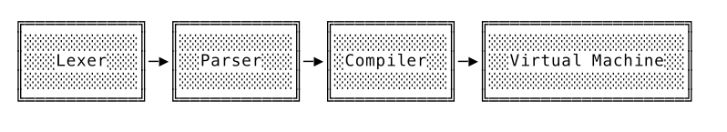
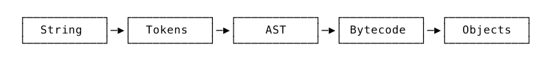

There are HuSharp's Go learning resoures.

### [7days-golang](https://github.com/geektutu/7days-golang)

- [Web Framework - GeeHTTP](./GeeHTTP)
- [Distributed Cache - GeeCache](./GeeCache/)
- [Object Relational Mapping - GeeORM](./GeeORM/)
- [RPC Framework - GeeRPC](./GeeRPC/)

### [Talent Plan TinyKV](https://github.com/HuSharp/talent-plan_tinykv)

The TinyKV course builds a key-value storage system with the Raft consensus algorithm. It is inspired by [MIT 6.824](https://pdos.csail.mit.edu/6.824/) and [TiKV Project](https://github.com/tikv/tikv).

After completing this course, you will have the knowledge to implement a horizontally scalable, highly available, key-value storage service with distributed transaction support. Also, you will have a better understanding of TiKV architecture and implementation.

### [Writing an interpreter in go](https://interpreterbook.com/)

- We started out by building the lexer that turns strings entered into the REPL into tokens. The lexer is defined in the lexer package and the tokens it generates can be found in the token package.
- After that, we built the parser, a top-down recursive-descent parser (often called a Pratt parser) that turns the tokens into an abstract syntax tree, which is abbreviated to AST. The nodes of the AST are defined in the ast package and the parser itself can be found in the parser package.
- After it went through the parser, a Monkey program is then represented in memory as a tree and the next step is to evaluate it. In order to do that we built an evaluator. That’s another name for a function called Eval, defined in the evaluator package. Eval recursively walks down the AST and evaluates it, using the object system we defined in the object package to produce values. It would, for example, turn an AST node representing 1 + 2 into an object.Integer{Value: 3}. With that, the life cycle of Monkey code would be complete and the result printed to the REPL.

### [Writing a compiler in go](https://compilerbook.com/)

We’re going to turn our tree-walking and on-the-fly-evaluating interpreter into a bytecode compiler and a virtual machine that executes the bytecode.

That’s not only immensely fun to build but also one of the most common interpreter architectures out there. Ruby, Lua, Python, Perl, Guile, different JavaScript implementations and many more programming languages are built this way. Even the mighty Java Virtual Machine interprets bytecode. Bytecode compilers and virtual machines are everywhere – and for good reason.

Besides providing a new layer of abstraction —— the bytecode that’s passed from the compiler to the virtual machine – that makes the system more modular, the main appeal of this architecture lies in its performance. Bytecode interpreters are fast.


  - In terms of data structures, you can see that there will be quite a few transformations until we end up with the 3 as our result:
  

Finally Compiler has three times faster – without low-level tweaking or extensive optimizations than Interpreter. You can get at `./Compiler/benchmark/fibonacci` to check.

```bash
$ ./fibonacci -engine=eval
engine=eval, result=9227465, duration=11.327551667s

$ ./fibonacci -engine=vm
engine=vm, result=9227465, duration=3.907876125s
```
